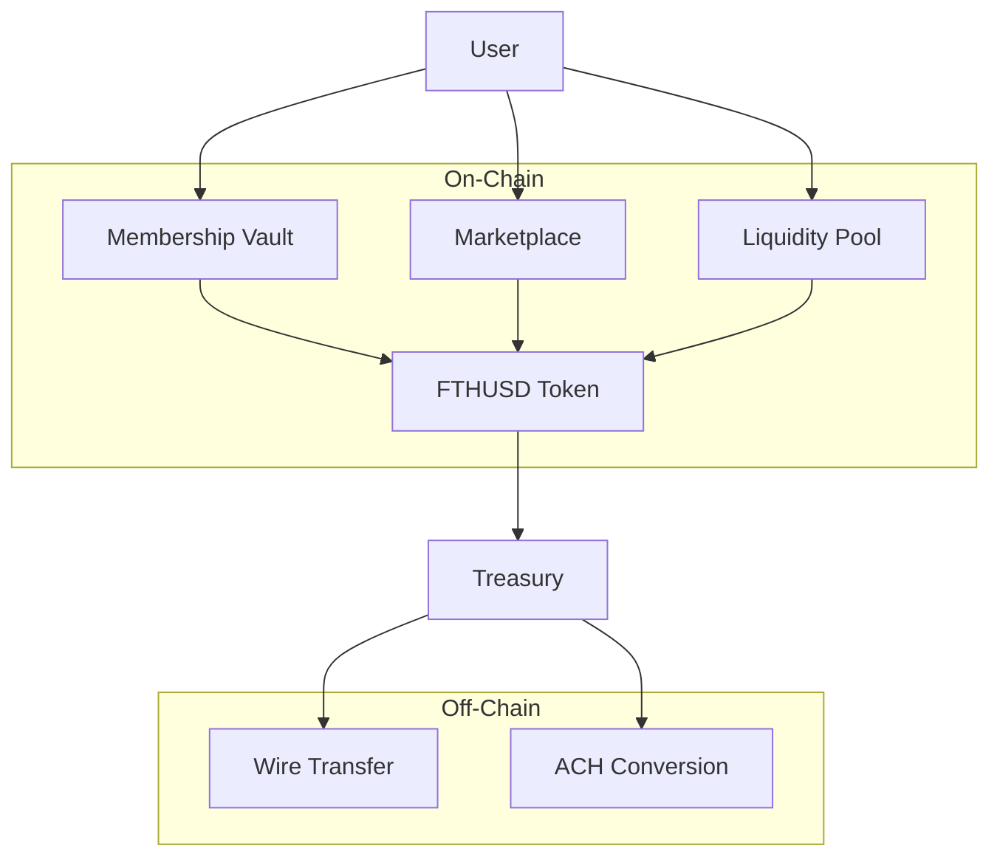
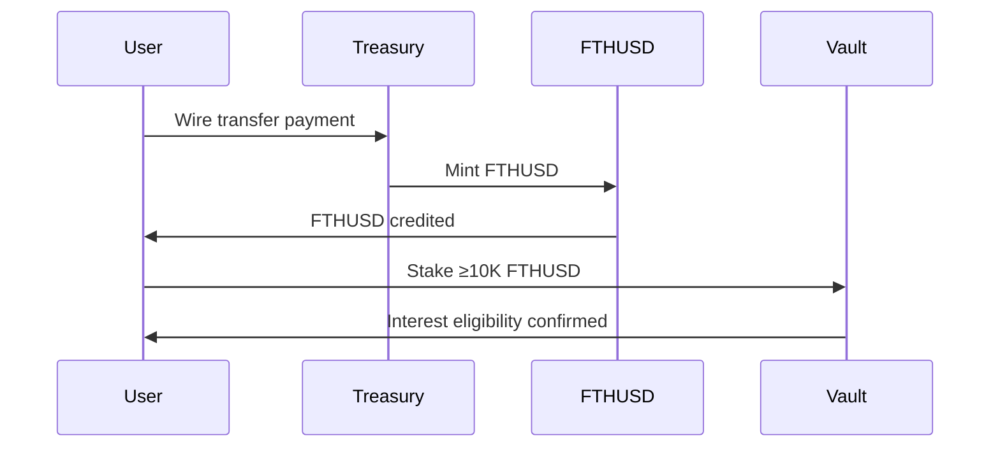
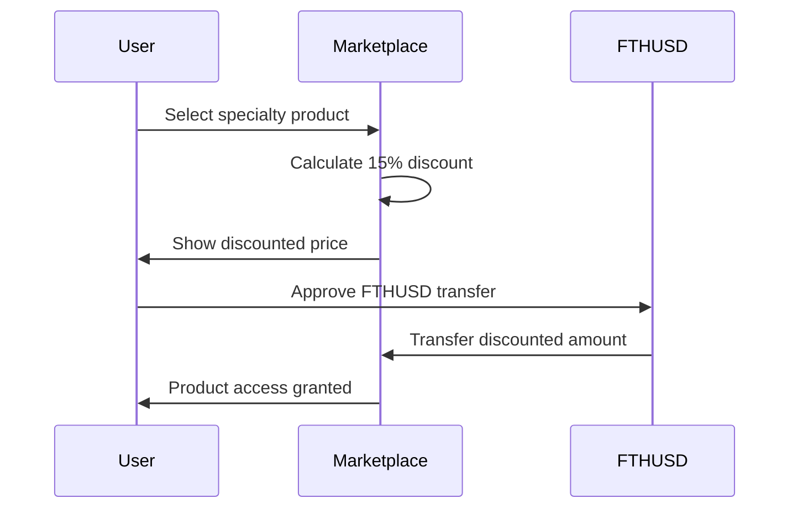
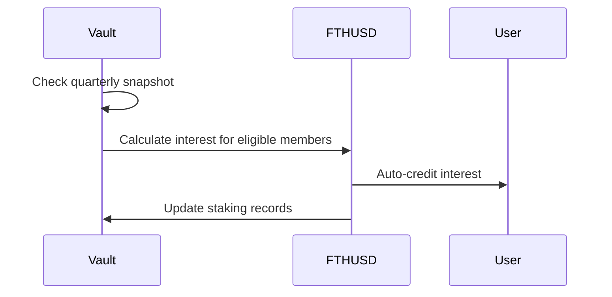

# FTHUSD Membership System

## Table of Contents
1. [Overview](#overview)
2. [Architecture](#architecture)
3. [Smart Contracts](#smart-contracts)
4. [Economic Model](#economic-model)
5. [User Flows](#user-flows)
6. [Technical Specifications](#technical-specifications)
7. [Deployment](#deployment)
8. [Testing](#testing)
9. [Roadmap](#roadmap)

## Overview

FTHUSD is an internal tokenized membership unit designed for a closed ecosystem. It operates as a membership-backed currency with staking rewards and exclusive marketplace access.

### Key Features
- **8% Annual Interest**: Distributed quarterly at 2% for balances ≥10,000 FTHUSD
- **15% Specialty Discounts**: Exclusive marketplace with discounted products
- **Restricted Transfers**: FTHUSD cannot be used outside the membership system
- **Wire Transfer Only**: For purchasing FTHUSD (no ACH)
- **1:1 Liquidity**: Maintained with USDC/USDT reserves

## Architecture



## Smart Contracts

### FTHUSD.sol
**Purpose**: Core token contract with membership logic
**Key Functions**:
- `mint(address member, uint256 amount)`: Treasury-controlled minting
- `redeem(address member, uint256 amount)`: Treasury-controlled redemption
- `transferInternal(address from, address to, uint256 amount)`: Restricted internal transfers
- `payQuarterlyInterest(address member)`: Interest distribution

### MembershipVault.sol
**Purpose**: Staking and interest calculation
**Key Functions**:
- `stake(uint256 amount)`: Stake FTHUSD for interest eligibility
- `unstake(uint256 amount)`: Unstake FTHUSD
- `calculateInterest(address member)`: Calculate quarterly interest
- `distributeInterest()`: Automated interest distribution

### Marketplace.sol
**Purpose**: Exclusive product marketplace with discounts
**Key Functions**:
- `addProduct(string name, uint256 price)`: Add specialty products
- `purchase(uint256 productId)`: Purchase with 15% discount using FTHUSD
- `getDiscountedPrice(uint256 productId)`: Calculate discounted price

### LiquidityPool.sol
**Purpose**: Maintain 1:1 liquidity with stablecoins
**Key Functions**:
- `addLiquidity(uint256 amount)`: Add stablecoin liquidity
- `swapFTHUSDForStable(uint256 fthusdAmount)`: Exchange FTHUSD for USDC/USDT
- `swapStableForFTHUSD(uint256 stableAmount)`: Exchange USDC/USDT for FTHUSD

## Economic Model

### Interest Mechanism
- **Annual Yield**: 8% (2% quarterly)
- **Minimum Balance**: 10,000 FTHUSD
- **Compounding**: Quarterly auto-compounding
- **Eligibility**: Must maintain ≥10K balance for full quarter

### Liquidity Management
- **Ratio**: 1:1 FTHUSD to USDC/USDT reserves
- **Peg**: Soft peg maintained through treasury operations
- **Redemption**: Always available at 1:1 ratio

### Payment Methods
- **FTHUSD Purchase**: Wire transfer only
- **Stablecoin Conversion**: ACH deposits converted to USDC/USDT
- **No Clawback**: Converted funds cannot be reversed

## User Flows

### New Member Onboarding


### Marketplace Purchase


### Interest Distribution


## Technical Specifications

### Token Details
- **Name**: FTHUSD Membership Unit
- **Symbol**: FTHUSD
- **Decimals**: 2
- **Supply**: Dynamic (minted/burned by treasury)

### Security Features
- **Access Control**: OnlyOwner for critical functions
- **Reentrancy Guards**: OpenZeppelin ReentrancyGuard
- **Input Validation**: Comprehensive checks
- **Emergency Pause**: Circuit breaker functionality

### Oracle Integration
- **Price Feeds**: Chainlink for stablecoin prices
- **Time Oracle**: For quarterly interest calculations
- **Keeper Network**: Automated interest distribution

## Deployment

### Prerequisites
- Node.js 16+
- Hardhat
- OpenZeppelin Contracts
- Chainlink integration

### Deployment Steps
1. Deploy FTHUSD.sol
2. Deploy MembershipVault.sol with FTHUSD address
3. Deploy Marketplace.sol with FTHUSD address
4. Deploy LiquidityPool.sol with FTHUSD and stablecoin addresses
5. Configure treasury addresses
6. Set up Chainlink keepers for automation

## Testing

### Test Coverage
- Unit tests for all contract functions
- Integration tests for user flows
- Edge case testing (minimum balances, overflows)
- Security testing (reentrancy, access control)

### Test Commands
```bash
npx hardhat test
npx hardhat coverage
```

## Roadmap

### Phase 1 (Current)
- Core smart contracts
- Basic staking and marketplace
- 1:1 liquidity management
- No compliance features

### Phase 2
- Compliance integration (KYC/AML)
- Advanced marketplace features
- Multi-chain deployment
- Governance mechanisms

### Phase 3
- DeFi integrations
- Cross-platform compatibility
- Advanced analytics
- Mobile application

---

*This documentation is for the FTHUSD Membership System MVP. All contracts are unaudited and for demonstration purposes only.*
