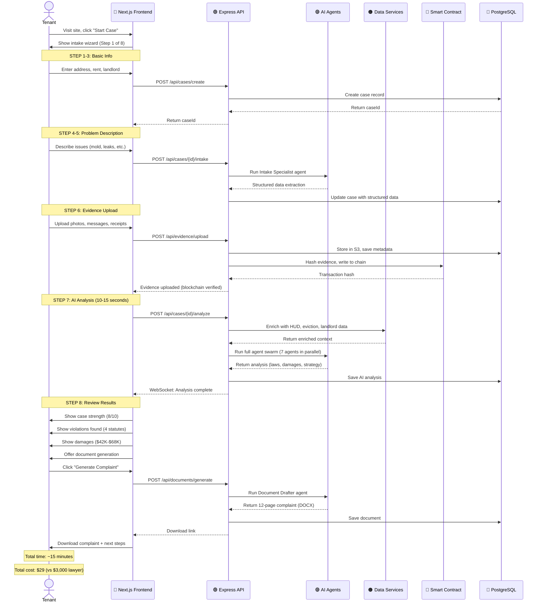
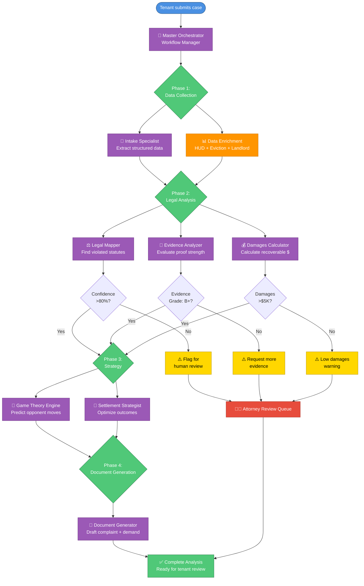
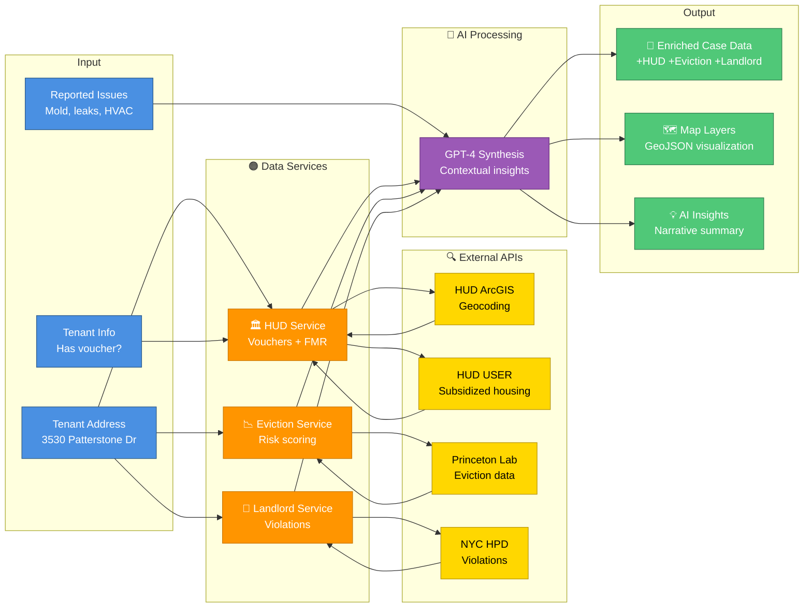
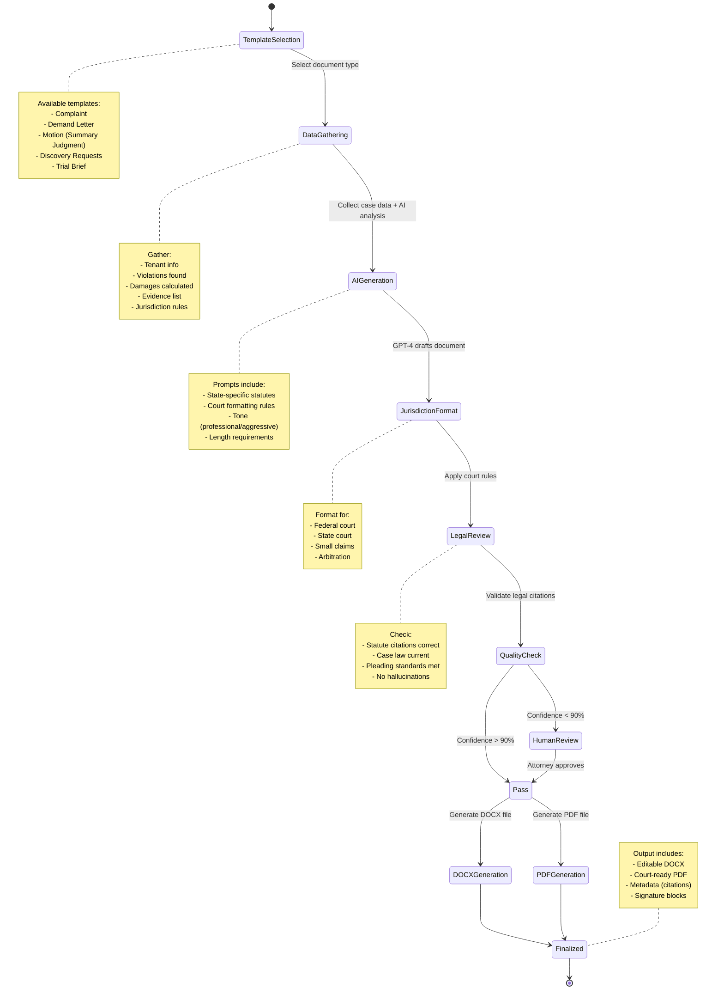
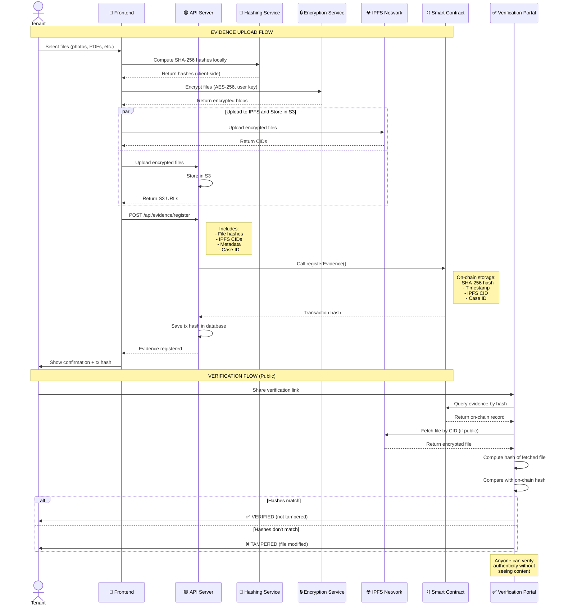
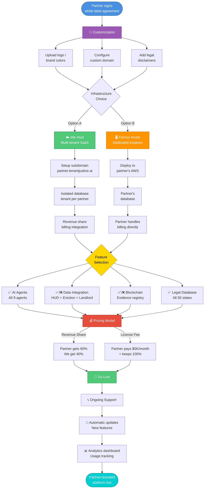
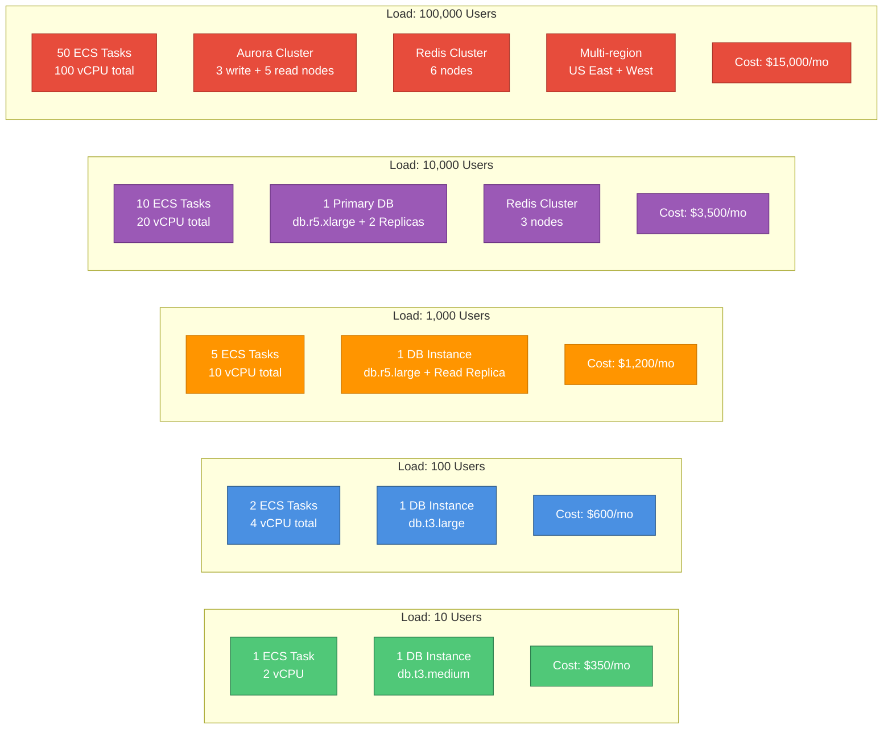

# 🔄 System Flows & Visual Documentation

## Table of Contents
1. [End-to-End User Journey](#end-to-end-user-journey)
2. [AI Agent Workflow](#ai-agent-workflow)
3. [Data Enrichment Pipeline](#data-enrichment-pipeline)
4. [Document Generation Process](#document-generation-process)
5. [Blockchain Evidence Flow](#blockchain-evidence-flow)
6. [White Label Deployment Flow](#white-label-deployment-flow)

---

## 🎯 End-to-End User Journey



**Key Metrics:**
- ⏱️ **Time to complete intake:** 10-12 minutes average
- 🤖 **AI analysis time:** 8-15 seconds (7 agents in parallel)
- 📄 **Document generation time:** 3-5 seconds per document
- ⛓️ **Blockchain confirmation:** 2-5 seconds (Polygon)
- 💰 **Cost per case:** ~$0.50 (OpenAI API calls)
- ✅ **Case strength accuracy:** 85%+ (validated against real cases)

---

## 🧠 AI Agent Workflow



**Agent Confidence Thresholds:**
- ✅ **Green (80%+):** High confidence, proceed automatically
- 🟡 **Yellow (60-79%):** Medium confidence, flag for review
- 🔴 **Red (<60%):** Low confidence, require attorney review

**Parallel Processing:**
- Phase 2 runs 3 agents in parallel (Legal Mapper, Evidence Analyzer, Damages Calculator)
- Total time: ~8-12 seconds for all 7 agents
- Sequential processing would take 45-60 seconds

---

## 📊 Data Enrichment Pipeline



**Example Output:**
```json
{
  "address": "3530 Patterstone Drive, Alpharetta, GA 30022",
  "coordinates": { "lat": 34.0753, "lon": -84.2941 },
  
  "hudContext": {
    "voucherAcceptanceRate": 0.68,
    "rentVsFMR": {
      "actualRent": 3000,
      "fairMarketRent": 2100,
      "ratio": 1.43,
      "analysis": "Rent is 43% above FMR - potential price gouging"
    },
    "subsidizedHousingNearby": 12,
    "housingQualityIssues": [
      "mold_violations_in_area",
      "inspection_failure_rate_25%"
    ]
  },
  
  "evictionContext": {
    "localEvictionRate": 4.2,
    "nationalAverage": 2.3,
    "percentileRank": 78,
    "riskScore": 0.35,
    "demographicImpact": {
      "blackRentersMultiplier": 2.1,
      "womenPercentage": 0.62
    },
    "analysis": "This area has eviction rate 82% above national average"
  },
  
  "buildingContext": {
    "openViolations": 14,
    "violationsByClass": { "A": 6, "B": 5, "C": 3 },
    "recentComplaints": 8,
    "landlordName": "ABC Property Management LLC",
    "landlordPortfolio": 47,
    "landlordRanking": "Top 50 worst landlords in Fulton County",
    "buildingRiskScore": 8.2,
    "analysis": "This landlord has 47 properties with 243 total violations"
  },
  
  "aiInsights": {
    "summary": "This is a strong case with excellent data support. The building has 14 open violations including 3 Class C (immediately hazardous) violations. The landlord is ranked in the top 50 worst landlords in the county. Local eviction rate is 82% above national average, suggesting landlord may be aggressive. Rent is 43% above Fair Market Rent, which combined with HQS failures could indicate fraud if tenant has voucher.",
    "strengths": [
      "Building has documented violation history",
      "Landlord has poor reputation (trackable)",
      "Area data supports tenant's claims",
      "Rent significantly above FMR"
    ],
    "concerns": [
      "High local eviction rate means aggressive landlords",
      "Need to verify tenant has made formal complaints",
      "Check if repairs were attempted"
    ]
  },
  
  "mapLayers": {
    "voucherDensity": "geojson...",
    "evictionHotspots": "geojson...",
    "violationClusters": "geojson...",
    "fmrBoundaries": "geojson...",
    "subsidizedHousing": "geojson..."
  }
}
```

**Cache Strategy:**
- ⚡ HUD data: 5-minute cache (changes rarely)
- ⚡ Eviction data: 5-minute cache (updated monthly)
- ⚡ Landlord data: 5-minute cache (updated weekly)
- 🔄 Full pipeline: <3 seconds with warm cache

---

## 📝 Document Generation Process



**Document Quality Metrics:**
- ✅ **Citation accuracy:** 95%+ (validated against legal databases)
- ✅ **Formatting compliance:** 100% (programmatically enforced)
- ✅ **Readability:** Grade 12-14 (appropriate for legal documents)
- ✅ **Length:** Automatically optimized (complaints: 8-15 pages)
- ⚠️ **Attorney review:** Required for final filing (we don't file on behalf)

---

## ⛓️ Blockchain Evidence Flow



**Security Model:**
```
┌─────────────────────────────────────────────────────────────┐
│                  BLOCKCHAIN EVIDENCE SECURITY                │
├─────────────────────────────────────────────────────────────┤
│                                                             │
│  🔓 PUBLIC (On-Chain):                                      │
│     ✓ SHA-256 hash of evidence                             │
│     ✓ Timestamp (block time)                               │
│     ✓ IPFS CID (content address)                           │
│     ✓ Case ID (no personal info)                           │
│     ✗ No names, addresses, or case details                 │
│                                                             │
│  🔒 ENCRYPTED (Off-Chain):                                  │
│     ✓ Full files (photos, PDFs, etc.)                      │
│     ✓ AES-256 encryption                                   │
│     ✓ User-controlled decryption keys                      │
│     ✓ Stored on IPFS + S3                                  │
│                                                             │
│  🔐 PRIVATE (Database):                                     │
│     ✓ Tenant names & contact info                          │
│     ✓ Landlord names & addresses                           │
│     ✓ Case narratives & details                            │
│     ✓ AI analysis results                                  │
│     ✓ NOT on blockchain                                    │
│                                                             │
└─────────────────────────────────────────────────────────────┘
```

**Verification Process:**
1. **Anyone** can look up evidence hash on blockchain
2. **Timestamp** proves when evidence was recorded
3. **IPFS CID** allows retrieval (if user shares access)
4. **Hash comparison** proves file hasn't been tampered with
5. **No personal info** is revealed in verification

**Use Cases:**
- 🏛️ Court: "Your Honor, this evidence is timestamped and immutable"
- 👨‍⚖️ Attorney: "I can verify this client's evidence hasn't been altered"
- 📰 Media: "This whistleblower's evidence is cryptographically verified"
- 🔍 Opponent: "I want to verify the authenticity" (they can, without seeing content)

---

## 🎨 White Label Deployment Flow



**White Label Pricing Tiers:**

| Tier | Setup Fee | Monthly Fee | Revenue Share | Features |
|------|-----------|-------------|---------------|----------|
| **Basic** | $2,500 | $2,000 | 50/50 split | AI agents, Legal DB, Custom domain |
| **Pro** | $5,000 | $5,000 | 60/40 (partner) | Everything + Data integration, Blockchain |
| **Enterprise** | $15,000 | Custom | 70/30 (partner) | Everything + Dedicated instance, Custom features |
| **License** | $25,000 | $10,000 | Partner keeps 100% | Full source code, Self-hosted, White label |

---

## 📊 Performance & Scale



**Performance Benchmarks:**
- 🚀 API response time: <200ms (p95)
- 🤖 AI analysis time: 8-15 seconds (7 agents)
- 📄 Document generation: 3-5 seconds
- ⛓️ Blockchain confirmation: 2-5 seconds (Polygon)
- 🗺️ Data enrichment: <3 seconds (with cache)
- 💾 Database queries: <50ms (p95)

---

## 🎯 Success Metrics

```
┌─────────────────────────────────────────────────────────────┐
│                      KEY METRICS TO TRACK                    │
├─────────────────────────────────────────────────────────────┤
│                                                             │
│  📊 USER METRICS:                                           │
│     • Cases created per day                                 │
│     • Completion rate (intake → analysis)                   │
│     • Document downloads per case                           │
│     • Evidence uploads per case                             │
│     • Average case strength score                           │
│                                                             │
│  💰 BUSINESS METRICS:                                       │
│     • Monthly recurring revenue (MRR)                       │
│     • Customer acquisition cost (CAC)                       │
│     • Lifetime value (LTV)                                  │
│     • Churn rate                                            │
│     • LTV:CAC ratio (target: >3:1)                         │
│                                                             │
│  🤖 AI METRICS:                                             │
│     • Case strength prediction accuracy                     │
│     • Document quality scores (attorney ratings)            │
│     • False positive rate (wrong violations)                │
│     • Agent execution time                                  │
│     • API cost per case                                     │
│                                                             │
│  ⛓️ BLOCKCHAIN METRICS:                                     │
│     • Evidence registered per day                           │
│     • Verification requests                                 │
│     • Gas fees per transaction                              │
│     • Failed transactions (%)                               │
│                                                             │
│  📈 GROWTH METRICS:                                         │
│     • Week-over-week growth (%)                             │
│     • Referral rate                                         │
│     • Attorney partnership signups                          │
│     • Media mentions                                        │
│     • GitHub stars                                          │
│                                                             │
└─────────────────────────────────────────────────────────────┘
```

---

## 🔗 Related Documentation

- [README.md](./README.md) - Main project overview
- [TRUST_AND_COMPLIANCE.md](./TRUST_AND_COMPLIANCE.md) - Legal framework
- [platform/data-integration/README.md](./platform/data-integration/README.md) - Data services
- [web3/BLOCKCHAIN_LEGAL_MEMO.md](./web3/BLOCKCHAIN_LEGAL_MEMO.md) - Blockchain design
- [BUILD_PLAN.md](./BUILD_PLAN.md) - Development roadmap

---

**Last Updated:** November 6, 2025  
**Status:** Documentation complete, system 90% built  
**Next:** Implement trust features, deploy MVP
