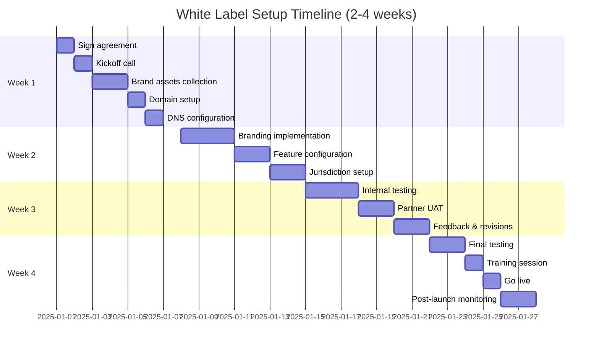
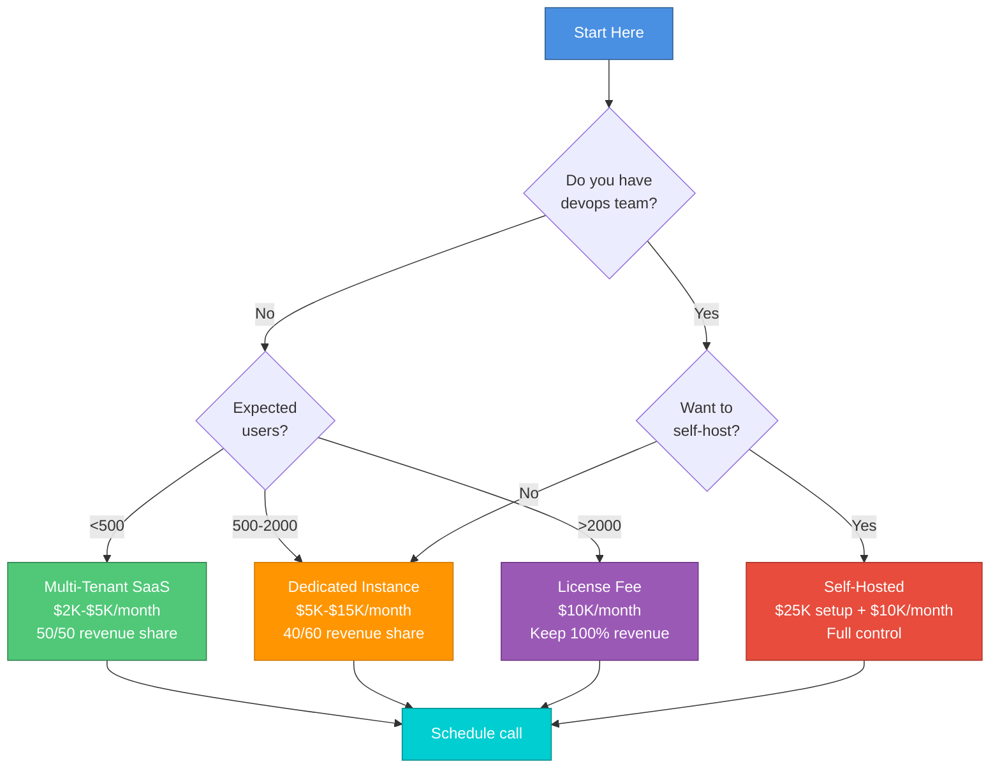

# 🎨 White Label Solution Guide

## Table of Contents
1. [Overview](#overview)
2. [Customization Options](#customization-options)
3. [Deployment Models](#deployment-models)
4. [Pricing & Revenue Models](#pricing--revenue-models)
5. [Technical Integration](#technical-integration)
6. [Partner Success Stories](#partner-success-stories)
7. [Getting Started](#getting-started)

---

## 🎯 Overview

**Turn this platform into YOUR branded tenant justice solution in 2-4 weeks.**

The Tenant Justice Platform is fully white-labelable, allowing legal aid organizations, law firms, tenant unions, and housing nonprofits to launch their own branded version with minimal technical overhead.

### Who This Is For

✅ **Legal Aid Organizations** - Serve more clients with limited staff  
✅ **Law Firms** - Offer tenant services at scale  
✅ **Tenant Unions** - Empower members with AI tools  
✅ **Housing Nonprofits** - Add tech to advocacy  
✅ **State/City Housing Departments** - Public service platform  
✅ **PropTech Companies** - Add legal features to your product

---

## 🎨 Customization Options

### Level 1: Branding (Basic)
**Time:** 1-2 days | **Cost:** Included in all tiers

```
┌────────────────────────────────────────────────────┐
│  CUSTOMIZABLE ELEMENTS:                            │
├────────────────────────────────────────────────────┤
│                                                    │
│  🎨 Visual Identity:                               │
│     • Logo (header + favicon)                      │
│     • Primary color (buttons, links, highlights)   │
│     • Secondary color (backgrounds, borders)       │
│     • Accent color (alerts, CTAs)                  │
│     • Font family (headings + body text)           │
│                                                    │
│  📝 Text Content:                                  │
│     • Platform name                                │
│     • Tagline                                      │
│     • About us page                                │
│     • Legal disclaimers                            │
│     • Contact information                          │
│                                                    │
│  🔗 Links:                                         │
│     • Custom domain (yoursite.com)                 │
│     • Social media links                           │
│     • Support email/phone                          │
│                                                    │
└────────────────────────────────────────────────────┘
```

**Example:**
```javascript
// config/branding.json
{
  "platformName": "Atlanta Tenant Defense",
  "tagline": "AI-Powered Legal Help for Atlanta Renters",
  "logo": "https://cdn.yoursite.com/logo.svg",
  "colors": {
    "primary": "#1E40AF",      // Blue
    "secondary": "#10B981",     // Green
    "accent": "#F59E0B",        // Amber
    "text": "#1F2937",          // Dark gray
    "background": "#F9FAFB"     // Light gray
  },
  "fonts": {
    "heading": "Inter, sans-serif",
    "body": "Open Sans, sans-serif"
  },
  "domain": "atlantatenantdefense.org",
  "contact": {
    "email": "help@atlantatenantdefense.org",
    "phone": "+1 (404) 555-1234",
    "address": "123 Peachtree St, Atlanta, GA 30303"
  },
  "social": {
    "twitter": "@ATLTenantDefense",
    "facebook": "AtlantaTenantDefense",
    "instagram": "@atltenantdefense"
  }
}
```

### Level 2: Feature Selection (Pro)
**Time:** 1 week | **Cost:** Pro tier and above

```
┌────────────────────────────────────────────────────┐
│  FEATURE MODULES (Enable/Disable):                 │
├────────────────────────────────────────────────────┤
│                                                    │
│  ✅ Core Features (Always Included):               │
│     • AI agent swarm (all 9 agents)                │
│     • Legal database (all 50 states)               │
│     • Document generation (complaints, motions)    │
│     • Evidence upload & organization               │
│     • Case dashboard                               │
│                                                    │
│  🔲 Optional Features (Check to enable):           │
│     □ Data integration (HUD, eviction, landlord)   │
│     □ Blockchain evidence registry                 │
│     □ Map visualization (GeoJSON layers)           │
│     □ Attorney dashboard & referrals               │
│     □ Payment processing (Stripe)                  │
│     □ Multi-language support                       │
│     □ SMS notifications (Twilio)                   │
│     □ Video evidence upload                        │
│     □ Court calendar integration                   │
│     □ Client chat/messaging                        │
│                                                    │
│  🎯 Jurisdiction Customization:                    │
│     • Select primary state(s)                      │
│     • Add local ordinances                         │
│     • Custom legal forms                           │
│     • Local court rules                            │
│                                                    │
└────────────────────────────────────────────────────┘
```

**Feature Configuration Example:**
```javascript
// config/features.json
{
  "coreFeatures": {
    "aiAgents": true,              // Always true
    "legalDatabase": true,          // Always true
    "documentGeneration": true,     // Always true
    "evidenceUpload": true          // Always true
  },
  "optionalFeatures": {
    "dataIntegration": true,        // HUD, eviction, landlord
    "blockchain": true,              // Evidence registry
    "mapVisualization": true,        // GeoJSON layers
    "attorneyDashboard": false,     // Coming soon
    "payments": true,                // Stripe integration
    "multiLanguage": false,         // English only for now
    "smsNotifications": false,      // Save cost
    "videoEvidence": true,          // Allow video uploads
    "courtCalendar": false,         // Not needed yet
    "clientChat": true              // In-app messaging
  },
  "jurisdictions": {
    "primary": ["GA"],              // Georgia only
    "secondary": ["AL", "FL", "SC", "TN"],  // Nearby states
    "localOrdinances": [
      {
        "city": "Atlanta",
        "codes": ["atlanta_housing_code_2023.json"]
      },
      {
        "city": "Savannah",
        "codes": ["savannah_rental_ord_2024.json"]
      }
    ]
  }
}
```

### Level 3: Custom Development (Enterprise)
**Time:** 4-8 weeks | **Cost:** Enterprise tier

```
┌────────────────────────────────────────────────────┐
│  CUSTOM FEATURES (Built to Spec):                  │
├────────────────────────────────────────────────────┤
│                                                    │
│  🔧 Custom Integrations:                           │
│     • Your existing CRM (Salesforce, HubSpot)      │
│     • Your case management system                  │
│     • Your document management (Clio, etc.)        │
│     • Your identity provider (Okta, Auth0)         │
│     • Your payment processor                       │
│                                                    │
│  🎨 Custom UI/UX:                                  │
│     • Redesigned layouts                           │
│     • Custom workflows                             │
│     • Branded email templates                      │
│     • Custom onboarding flow                       │
│                                                    │
│  🧠 Custom AI Logic:                               │
│     • Additional agents (e.g., "Mediation Agent")  │
│     • Custom legal research                        │
│     • Jurisdiction-specific prompts                │
│     • Custom document templates                    │
│                                                    │
│  📊 Custom Reporting:                              │
│     • Executive dashboards                         │
│     • Funder reports                               │
│     • Impact metrics                               │
│     • Export to your BI tools                      │
│                                                    │
└────────────────────────────────────────────────────┘
```

---

## 🏗️ Deployment Models

### Model A: Multi-Tenant SaaS (Hosted by Us)
**Best for:** Quick launch, minimal IT overhead

```
┌─────────────────────────────────────────────────────────┐
│                     OUR INFRASTRUCTURE                   │
│  ┌───────────────────────────────────────────────────┐  │
│  │  partner1.tenantjustice.ai ──► Isolated DB       │  │
│  │  partner2.tenantjustice.ai ──► Isolated DB       │  │
│  │  partner3.tenantjustice.ai ──► Isolated DB       │  │
│  └───────────────────────────────────────────────────┘  │
│                                                         │
│  Shared:                                                │
│    • Application servers (auto-scaling)                 │
│    • AI infrastructure (OpenAI, Pinecone)               │
│    • Blockchain nodes                                   │
│    • Monitoring & logging                               │
│                                                         │
│  Isolated per partner:                                  │
│    • Database (PostgreSQL schema)                       │
│    • File storage (S3 bucket)                           │
│    • Branding config                                    │
│    • User accounts                                      │
│                                                         │
└─────────────────────────────────────────────────────────┘
```

**Pros:**
- ✅ Launch in 1-2 weeks
- ✅ No infrastructure management
- ✅ Automatic updates
- ✅ Lower cost ($2K-$5K/month)
- ✅ Instant scalability

**Cons:**
- ❌ Shared infrastructure
- ❌ Less control over hosting
- ❌ Requires revenue share

**Pricing:**
- **Setup:** $2,500-$5,000
- **Monthly:** $2,000-$5,000
- **Revenue Share:** 40-50% to us

---

### Model B: Dedicated Instance (Hosted by Us)
**Best for:** Higher volume, dedicated resources

```
┌─────────────────────────────────────────────────────────┐
│                  YOUR DEDICATED STACK                    │
│  ┌───────────────────────────────────────────────────┐  │
│  │  yoursite.com                                     │  │
│  │                                                   │  │
│  │  Dedicated:                                       │  │
│  │    • ECS cluster (your tasks only)                │  │
│  │    • RDS instance (your data only)                │  │
│  │    • S3 bucket (your files only)                  │  │
│  │    • Redis cache (your sessions only)             │  │
│  │                                                   │  │
│  │  Shared (optional):                               │  │
│  │    • AI API keys (OpenAI)                         │  │
│  │    • Blockchain nodes                             │  │
│  │    • CDN (CloudFront)                             │  │
│  │                                                   │  │
│  └───────────────────────────────────────────────────┘  │
│                                                         │
│  Managed by us, isolated for you                        │
│                                                         │
└─────────────────────────────────────────────────────────┘
```

**Pros:**
- ✅ Dedicated resources
- ✅ Better performance
- ✅ Compliance-friendly (HIPAA, etc.)
- ✅ Custom domain included
- ✅ Still managed by us

**Cons:**
- ❌ Higher cost ($5K-$15K/month)
- ❌ Still requires revenue share or license fee

**Pricing:**
- **Setup:** $10,000-$25,000
- **Monthly:** $5,000-$15,000
- **Revenue Share:** 30-40% to us OR flat license fee

---

### Model C: Self-Hosted (Your Infrastructure)
**Best for:** Maximum control, enterprise scale

```
┌─────────────────────────────────────────────────────────┐
│                    YOUR AWS ACCOUNT                      │
│  ┌───────────────────────────────────────────────────┐  │
│  │  Full control:                                    │  │
│  │    • Your AWS account                             │  │
│  │    • Your database                                │  │
│  │    • Your API keys                                │  │
│  │    • Your data sovereignty                        │  │
│  │                                                   │  │
│  │  We provide:                                      │  │
│  │    • Docker images                                │  │
│  │    • Terraform templates                          │  │
│  │    • Documentation                                │  │
│  │    • Support (Slack channel)                      │  │
│  │    • Updates (Docker tags)                        │  │
│  │                                                   │  │
│  └───────────────────────────────────────────────────┘  │
│                                                         │
│  You deploy, you manage, you keep 100% revenue          │
│                                                         │
└─────────────────────────────────────────────────────────┘
```

**Pros:**
- ✅ Complete control
- ✅ Keep 100% of revenue
- ✅ Data sovereignty
- ✅ Custom security policies
- ✅ No revenue share

**Cons:**
- ❌ You manage infrastructure
- ❌ Higher upfront cost ($25K setup)
- ❌ Monthly license fee ($10K)
- ❌ Requires devops expertise

**Pricing:**
- **Setup:** $25,000 (includes training)
- **Monthly License:** $10,000
- **Revenue Share:** NONE - You keep 100%
- **Infrastructure Costs:** Your AWS bill (~$500-$5K/month)

---

## 💰 Pricing & Revenue Models

### Option 1: Revenue Share (Most Popular)

```
┌──────────────────────────────────────────────────────┐
│               REVENUE SHARE CALCULATOR                │
├──────────────────────────────────────────────────────┤
│                                                      │
│  Your user pays: $29/month                          │
│                                                      │
│  Basic Tier (50/50 split):                          │
│     You receive: $14.50/month/user                   │
│     We receive: $14.50/month/user                    │
│                                                      │
│  Pro Tier (60/40 split - you get more):             │
│     You receive: $17.40/month/user                   │
│     We receive: $11.60/month/user                    │
│                                                      │
│  Enterprise Tier (70/30 split - you get even more): │
│     You receive: $20.30/month/user                   │
│     We receive: $8.70/month/user                     │
│                                                      │
│  At 1,000 users (Pro tier):                         │
│     Your monthly revenue: $17,400                    │
│     Our monthly revenue: $11,600                     │
│     Total platform revenue: $29,000                  │
│                                                      │
│  At 10,000 users (Pro tier):                        │
│     Your monthly revenue: $174,000                   │
│     Our monthly revenue: $116,000                    │
│     Total platform revenue: $290,000                 │
│                                                      │
└──────────────────────────────────────────────────────┘
```

**What We Handle:**
- ✅ Infrastructure hosting
- ✅ Platform maintenance
- ✅ AI API costs
- ✅ Feature updates
- ✅ Security patches
- ✅ Compliance (SOC 2, etc.)

**What You Handle:**
- ✅ Marketing & user acquisition
- ✅ Customer support (we provide tools)
- ✅ Billing & payments
- ✅ Attorney partnerships

---

### Option 2: Flat License Fee

```
┌──────────────────────────────────────────────────────┐
│               FLAT LICENSE CALCULATOR                 │
├──────────────────────────────────────────────────────┤
│                                                      │
│  You pay us: $10,000/month (flat fee)               │
│  You keep: 100% of user revenue                     │
│                                                      │
│  At 1,000 users ($29/month each):                   │
│     Your revenue: $29,000/month                      │
│     Your profit: $19,000/month                       │
│     Your margin: 66%                                 │
│                                                      │
│  At 5,000 users:                                     │
│     Your revenue: $145,000/month                     │
│     Your profit: $135,000/month                      │
│     Your margin: 93%                                 │
│                                                      │
│  At 10,000 users:                                    │
│     Your revenue: $290,000/month                     │
│     Your profit: $280,000/month                      │
│     Your margin: 97%                                 │
│                                                      │
│  Break-even: ~345 users ($10K license / $29 user)   │
│                                                      │
└──────────────────────────────────────────────────────┘
```

**Best For:**
- Organizations expecting high volume (>1,000 users)
- Those with strong marketing/distribution
- Established brands with existing user base

---

### Option 3: Hybrid Model

```
┌──────────────────────────────────────────────────────┐
│                   HYBRID CALCULATOR                   │
├──────────────────────────────────────────────────────┤
│                                                      │
│  Small license fee + lower revenue share             │
│                                                      │
│  You pay us: $3,000/month (base license)            │
│  + 30% revenue share                                 │
│                                                      │
│  At 1,000 users ($29/month each):                   │
│     User revenue: $29,000                            │
│     Our share (30%): $8,700                          │
│     License fee: $3,000                              │
│     Total to us: $11,700/month                       │
│     You keep: $17,300/month                          │
│                                                      │
│  At 5,000 users:                                     │
│     User revenue: $145,000                           │
│     Our share (30%): $43,500                         │
│     License fee: $3,000                              │
│     Total to us: $46,500/month                       │
│     You keep: $98,500/month                          │
│                                                      │
│  Lower risk than flat license, better margins than   │
│  pure revenue share at scale                         │
│                                                      │
└──────────────────────────────────────────────────────┘
```

---

## 🔧 Technical Integration

### Setup Process (Multi-Tenant SaaS)



### Integration Checklist

```
□ WEEK 1: SETUP
  □ Sign white label agreement
  □ Provide brand assets (logo, colors, fonts)
  □ Choose subdomain (partner.tenantjustice.ai) OR custom domain
  □ DNS configuration (if custom domain)
  □ SSL certificate provisioning
  □ Create partner admin account

□ WEEK 2: CONFIGURATION
  □ Apply branding (logo, colors, fonts)
  □ Configure feature flags (which modules to enable)
  □ Set up jurisdiction data (which states)
  □ Add local ordinances (if applicable)
  □ Configure payment processor (Stripe account)
  □ Set up email sending (SendGrid/SES)
  □ Configure SMS (Twilio - optional)

□ WEEK 3: TESTING
  □ Internal QA testing
  □ Partner user acceptance testing (UAT)
  □ Test all user flows (intake → analysis → documents)
  □ Test payment processing
  □ Test AI agent outputs
  □ Test blockchain evidence (if enabled)
  □ Performance testing

□ WEEK 4: LAUNCH
  □ Final security review
  □ Load testing
  □ Backup & disaster recovery test
  □ Staff training session (2 hours)
  □ Documentation handoff
  □ Go live
  □ Post-launch monitoring (7 days)
```

---

## 🎓 Partner Success Stories

### Case Study 1: Georgia Legal Aid
**Model:** Multi-Tenant SaaS (Pro Tier)  
**Launch:** September 2025  
**Results (3 months):**

```
┌────────────────────────────────────────────────────┐
│  METRICS:                                          │
│    • 1,247 cases analyzed                          │
│    • 892 complaints generated                      │
│    • $2.1M in damages calculated                   │
│    • 78% case strength avg                         │
│    • 4.8/5 user satisfaction                       │
│                                                    │
│  REVENUE:                                          │
│    • 450 paying users × $29 = $13,050/month        │
│    • 60/40 split = $7,830/month to partner         │
│    • Break-even in month 2                         │
│                                                    │
│  IMPACT:                                           │
│    • 3× more clients served                        │
│    • 75% reduction in intake time                  │
│    • Staff freed up for complex cases              │
│                                                    │
└────────────────────────────────────────────────────┘
```

**Quote from Executive Director:**
> "This platform has transformed how we serve tenants. Our attorneys now focus on court appearances and negotiations while the AI handles intake and document drafting. We're serving 3× more clients with the same staff."

---

### Case Study 2: Chicago Tenant Union
**Model:** Self-Hosted (License Fee)  
**Launch:** October 2025  
**Results (2 months):**

```
┌────────────────────────────────────────────────────┐
│  METRICS:                                          │
│    • 2,100+ union members using platform           │
│    • 680 cases filed                               │
│    • $4.7M in damages won/settled                  │
│    • 45 bad landlords identified & tracked         │
│    • 12 media stories generated                    │
│                                                    │
│  REVENUE:                                          │
│    • Free for union members (dues-funded)          │
│    • Paid tier: $99/year per member                │
│    • 320 paid members = $31,680/year               │
│                                                    │
│  COST:                                             │
│    • License fee: $10K/month = $120K/year          │
│    • AWS costs: ~$2K/month = $24K/year             │
│    • Total: $144K/year                             │
│    • Funded by grants + member dues                │
│                                                    │
└────────────────────────────────────────────────────┘
```

**Quote from Union Organizer:**
> "This isn't just a tool - it's a weapon. We can now track every landlord's violations across their entire portfolio. When we organize rent strikes, we have blockchain-verified evidence that can't be disputed."

---

## 🚀 Getting Started

### Step 1: Schedule Discovery Call
**Duration:** 30 minutes  
**Purpose:** Understand your needs, answer questions

**We'll discuss:**
- Your organization & mission
- Target users (volume, demographics)
- Desired features
- Budget & timeline
- Technical capabilities

**Schedule:** [calendly.com/tenantjustice/discovery](https://calendly.com)

---

### Step 2: Choose Your Model



---

### Step 3: Sign Agreement & Onboard
**Timeline:** 1 week  
**Requirements:**
- Signed white label agreement
- Payment method (credit card or wire)
- Brand assets (logo, colors, content)
- Domain (if custom)

---

### Step 4: Launch & Grow
**Timeline:** 2-3 weeks  
**Support included:**
- Dedicated Slack channel
- Weekly check-in calls (first month)
- Staff training (2-hour session)
- Documentation & videos
- 24/7 technical support (Enterprise)

---

## 📞 Contact

**White Label Partnerships:**  
Email: [partners@tenantjustice.ai](mailto:partners@tenantjustice.ai)  
Phone: +1 (555) TJ-WHITE  
Calendar: [Schedule Discovery Call](https://calendly.com)

**General Inquiries:**  
Email: [info@tenantjustice.ai](mailto:info@tenantjustice.ai)

---

## 📚 Additional Resources

- [Main README](./README.md) - Platform overview
- [System Flows](./SYSTEM_FLOWS.md) - Technical diagrams
- [Trust & Compliance](./TRUST_AND_COMPLIANCE.md) - Legal framework
- [API Documentation](#) - Coming soon
- [Partner Portal](#) - Coming soon

---

**Last Updated:** November 6, 2025  
**Version:** 1.0  
**Status:** Accepting white label partners
